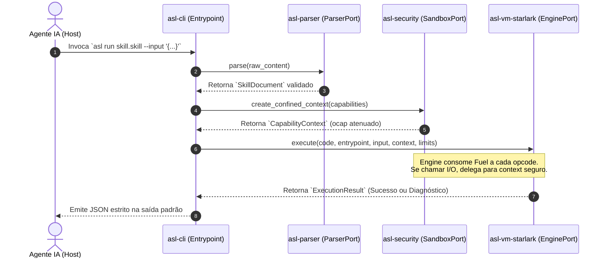

# Arquitetura Modular AI-First do Projeto ASL 3.0 (Agent Skill Language)

---

## 1. Visão Geral & Princípios Fundamentais de Design

Este documento especifica a **arquitetura de software de referência** para o projeto **Agent Skill Language (ASL)**. O sistema foi concebido sob o paradigma **AI-First & Hexagonal (Ports & Adapters)**, onde cada componente é **estritamente desacoplado, ortogonal e 100% substituível**.

```
                             ┌───────────────────────────────┐
                             │       asl-cli / libasl        │ (Aplicações / Entrypoints)
                             └───────────────┬───────────────┘
                                             │ [Dependency Injection]
               ┌─────────────────────────────┼─────────────────────────────┐
               ▼                             ▼                             ▼
     ┌───────────────────┐         ┌───────────────────┐         ┌───────────────────┐
     │ asl-protocol-mcp  │         │  asl-vm-starlark  │         │   asl-security    │ (Adaptadores)
     │ (Transporte MCP)  │         │ (Engine Starlark) │         │ (Sandbox & Ocap)  │
     └─────────┬─────────┘         └─────────┬─────────┘         └─────────┬─────────┘
               │                             │                             │
               │ [Implements]                │ [Implements]                │ [Implements]
               ▼                             ▼                             ▼
     ┌───────────────────┐         ┌───────────────────┐         ┌───────────────────┐
     │  asl-core-traits  │◄────────┤  asl-core-traits  │────────►│  asl-core-traits  │ (Portas / Interfaces)
     │  (ProtocolPort)   │         │   (EnginePort)    │         │   (SandboxPort)   │
     └─────────┬─────────┘         └─────────┬─────────┘         └─────────┬─────────┘
               │                             │                             │
               └─────────────────────────────┼─────────────────────────────┘
                                             │ [Uses]
                                             ▼
                                   ┌───────────────────┐
                                   │     asl-spec      │ (Tipos Puros / Zero-Dep)
                                   │ (AST, Manifest,   │
                                   │  Types, Errors)   │
                                   └───────────────────┘
```

---

## 2. Por que esta Arquitetura é "AI-First"?

A arquitetura foi desenhada não apenas para usuários humanos, mas especificamente para **Agentes de IA autônomos (Claude Code, Antigravity, Cursor, OpenAI Operator)** desenvolverem, refatorarem e manterem a base de código sem sobrecarga de contexto ou risco de efeitos colaterais.

### 2.1 Os 6 Pilares AI-First

| Pilar AI-First | Mecanismo de Engenharia | Benefício para o Agente de IA |
| :--- | :--- | :--- |
| **1. Contenção Cognitiva de Contexto** | Nenhum arquivo de código ultrapassa $300\text{ a }400$ linhas. | O agente carrega e raciocina sobre módulos inteiros em uma única janela de atenção sem truncamento. |
| **2. Grafo Acíclico Estrito (Zero Circular Deps)** | A crate `asl-spec` no fundo do grafo é pura ($0$ dependências I/O). | A IA pode alterar a camada de tipos sem risco de quebrar pipelines em cascata. |
| **3. Testabilidade Hermética por Mocks** | Cada crate possui mocks em memória (`MockSandbox`, `MockEngine`). | A IA valida suas alterações localmente via `cargo test -p <crate>` em $< 1\text{ segundo}$, sem IO real. |
| **4. Concorrência de Subagentes Sem Conflitos** | Crates 100% desacopladas por traits (`ports`). | Múltiplos subagentes podem trabalhar simultaneamente (ex: Agente A no parser, Agente B no motor WASM) com zero git merge conflicts. |
| **5. Autodescrição por Contratos de Tipos** | Interfaces definidas como Traits explícitos do Rust. | O modelo lê apenas o `trait` para saber exatamente o que implementar, sem precisar de documentação externa ambígua. |
| **6. Imunidade a Regressões Silenciosas** | Tipagem forte e testes de propriedade (*proptests*). | O compilador do Rust atua como linter determinístico de primeira linha para qualquer código gerado pelo agente. |

---

## 3. Decomposição Modular do Workspace Cargo

O projeto é estruturado como um Workspace Cargo modular com 7 micro-crates ativas e extensões planejadas:

```
agent skill language/runtime/
├── Cargo.toml                     # Configuração do Workspace
└── crates/
    ├── asl-spec/                  # [Nível 0] Tipos Fundamentais, AST e Erros (Zero-Dependency)
    ├── asl-core-traits/           # [Nível 1] Contratos Formais de Interfaces (Ports)
    ├── asl-parser/                # [Nível 2] Parser Híbrido CommonMark/YAML e Gerador CFG
    ├── asl-security/              # [Nível 2] Sistema de Capabilities Atenuadas e Sandboxing
    ├── asl-vm-starlark/           # [Nível 2] Adaptador de Engine Starlark Hermético (Default)
    ├── asl-protocol-mcp/          # [Nível 2] Adaptador de Transporte MCP (JSON-RPC stdio)
    ├── asl-cli/                   # [Nível 3] Executável CLI Multifuncional (Injeção de Dependências)
    ├── asl-vm-wasm/               # [Extensão Roadmap] Adaptador de Engine WASI/Wasm
    └── asl-ffi/                   # [Extensão Roadmap] Biblioteca C-ABI Segura (libasl)
```

---

## 4. Detalhamento de Cada Módulo e Suas Fronteiras (Ports & Adapters)

### 4.1 `asl-spec`: A Fundação Pura (Pure Domain Layer)
- **Responsabilidade Única**: Modelar a ontologia do ASL sem qualquer efeito colateral de I/O, rede ou sistema operacional.
- **Dependências Externas**: Apenas `serde` e `thiserror`.
- **Estruturas Principais**:
  - `SkillManifest`: Modelo de metadados, versões, esquemas de entrada/saída.
  - `SkillDocument`: Representação em memória do arquivo ASL (`.skill`, `.tool`, `.asl`) parseado.
  - `Capability`: Enum de permissões atenuadas (`Fs(ConfinedRoot)`, `Net(Domain)`).
  - `Limits`: Orçamento de combustível (`fuel`), memória (`heap_kib`) e timeout.
  - `ExecutionResult`: Saída determinística padronizada com diagnósticos.
  - `AslError`: Tipos canônicos de falha normalizados para evitar *covert channels*.

---

### 4.2 `asl-core-traits`: As Portas de Intercâmbio (Ports)
Define os contratos abstratos que tornam **todo o sistema intercambiável**. Se amanhã quisermos trocar o Starlark por Lua, QuickJS ou um Bytecode customizado, apenas implementamos o trait `EnginePort`!

```rust
// crates/asl-core-traits/src/engine.rs
use asl_spec::{ExecutionResult, Limits, Result};
use serde_json::Value;

/// Porta abstrata de execução de código determinístico
pub trait EnginePort: Send + Sync {
    /// Nome identificador do motor (ex: "starlark-hermetic", "wasm-component")
    fn name(&self) -> &'static str;

    /// Avalia uma função determinística dentro de um contexto com capacidades limitadas
    fn execute(
        &self,
        code: &str,
        entrypoint: &str,
        input_args: &Value,
        context: &dyn CapabilityContext,
        limits: &Limits,
    ) -> Result<ExecutionResult>;
}

/// Porta abstrata de injeção de capacidades seguras (ocap)
pub trait CapabilityContext: Send + Sync {
    fn read_file(&self, path: &str) -> Result<Option<String>>;
    fn check_fuel(&self) -> Result<u64>;
}
```

```rust
// crates/asl-core-traits/src/lib.rs
use asl_spec::{SkillDocument, Result};

/// Porta abstrata de parsing de documentos ASL (.skill, .tool, .asl)
pub trait ParserPort: Send + Sync {
    fn parse(&self, raw_content: &str) -> Result<SkillDocument>;
}

/// Porta abstrata de compilação de gramáticas para o LLM
pub trait GrammarCompilerPort: Send + Sync {
    fn compile_to_gbnf(&self, json_schema: &serde_json::Value) -> Result<String>;
    fn compile_to_regex_cfg(&self, json_schema: &serde_json::Value) -> Result<String>;
}

/// Porta do Transpilador Semântico de Regras (asl:rules)
pub trait RulesTranspilerPort: Send + Sync {
    fn transpile(
        &self,
        rules_source: &str,
        manifest: &asl_spec::SkillManifest,
        entrypoint: &str,
    ) -> Result<TranspilationResult>;
}
```

---

### 4.3 `asl-parser`: O Adaptador de Sintaxe
- **Responsabilidade**: Ler arquivos ASL (`.skill`, `.tool`, `.asl`), separar a AST de Duplo Consumidor (YAML Frontmatter + CommonMark Markdown + Bloco de Código Determinístico / Regras Semânticas), gerenciar a Projeção Sombra (`.md` exclusivo para `.skill`), transpilar regras (`asl:rules`) e compilar o esquema JSON em regras GBNF/CFG.
- **Implementa**: `ParserPort`, `GrammarCompilerPort`, `RulesTranspilerPort`.
- **Substituibilidade**: Pode ser substituído por um parser baseado em `pest`, `nom` ou árvore binária sem que o motor de execução sequer perceba.

---

### 4.4 `asl-security`: O Adaptador de Sandbox e Capabilities
- **Responsabilidade**: Aplicar os princípios de *Object-Capabilities (ocap)* e o confinamento de Lampson.
- **Implementa**: `CapabilityContext`.
- **Mecanismos Internos**:
  - `check_path_confinement`: Resolução canônica de caminhos com verificação de enraizamento estrito contra path traversal.
  - `MockSecurityContext`: Módulo de teste puro em memória onde arquivos e rede são simulados em `HashMap`, permitindo que testes de IA rodem em microssegundos sem tocar no SSD.

---

### 4.5 `asl-vm-starlark`: O Adaptador de Execução Hermética Padrão
- **Responsabilidade**: Avaliar o código funcional usando a engine Starlark em Rust com fuel metering.
- **Implementa**: `EnginePort`.
- **Garantias**:
  - Zero autoridade ambiente (sem acesso a variáveis de sistema ou relógio global).
  - Laços iterativos limitados e ausência de recursão não-terminante.
  - Término comprovável garantido por decremento de Fuel por opcode/tick (`set_max_tick_count`).

---

### 4.6 `asl-protocol-mcp`: O Adaptador de Transporte MCP
- **Responsabilidade**: Expor ferramentas em conformidade com o padrão aberto **Model Context Protocol (MCP)** sobre `stdio` (JSON-RPC 2.0).
- **Substituibilidade**: É uma casca externa desacoplada. Se o usuário quiser rodar o ASL sem MCP, este módulo sequer é compilado ou carregado.
- **Robustez**: O `stdout` é reservado exclusivamente para o protocolo JSON-RPC formatado; todos os logs e traces são isolados no `stderr`, eliminando as quebras de pipe típicas de servidores MCP em Node/Python.

---

### 4.7 `asl-ffi`: A Interface C-ABI de Baixa Latência (`libasl`)
- **Responsabilidade**: Permitir que Python, Node.js, Go ou C++ incorporem o runtime em memória.
- **Garantias (Bryan Cantrill)**:
  - Alocação em arenas de memória descartáveis (`bumpalo`) com reciclagem $O(1)$.
  - Proteção total contra pânico via `std::panic::catch_unwind`. Erros de código Starlark nunca causam `abort()` no processo do agente hospedeiro.

---

### 4.8 `asl-cli`: O Orquestrador de Linha de Comando
- **Responsabilidade**: Ponto de entrada CLI para humanos e scripts (`asl run`, `asl serve`, `asl check`, `asl compile-grammar`).
- **Arquitetura**: Utiliza **Injeção de Dependência** pura para ligar as portas aos adaptadores:
  ```rust
  let parser = CommonMarkYamlParser::new();
  let security = HostSecurityManager::new(manifest.capabilities);
  let engine = StarlarkHermeticEngine::new();
  
  // Execução desacoplada
  let doc = parser.parse(&raw_content)?;
  let result = engine.execute(&doc.code, &entrypoint, &args, &security, &doc.limits)?;
  ```

---

## 5. Matriz de Substituibilidade: Como Trocar Qualquer Componente

A prova de que a arquitetura é verdadeiramente modular é a facilidade com que qualquer peça fundamental pode ser substituída sem alterar uma única linha das outras crates:

| Quero Substituir... | Módulo Afetado | O que preciso fazer? | Impacto nas outras crates |
| :--- | :--- | :--- | :--- |
| **Trocar Starlark por WASM / Wasmtime** | Criar crate `asl-vm-wasm` | Implementar `EnginePort` usando o runtime Wasmtime. | **Zero**. `asl-spec`, `asl-parser`, `asl-cli` continuam idênticos. |
| **Trocar Parser Markdown por Gramática EBNF Pest** | Criar crate `asl-parser-pest` | Implementar `ParserPort` gerando a mesma struct `SkillDocument`. | **Zero**. A engine e a segurança nem sabem de onde veio a AST. |
| **Trocar Transporte MCP stdio por Servidor HTTP REST/SSE** | Criar crate `asl-server-http` | Consumir `EnginePort` e expor endpoints HTTP. | **Zero**. O motor determinístico não tem noção de transporte de rede. |
| **Trocar Sandbox do SO por Máquinas Virtuais Leves (gVisor/Firecracker)** | Modificar `asl-security` | Implementar `CapabilityContext` delegando chamadas para um micro-hypervisor. | **Zero**. O código Starlark continua chamando `ctx.fs.read()`. |

---

## 6. Guia Prático AI-First: Como IAs Devem Operar Neste Repositório

Se você é um Agente de IA (Antigravity, Claude Code, etc.) realizando uma tarefa neste repositório, siga rigorosamente este protocolo:

```
┌─────────────────────────────────────────────────────────────────────────┐
│                    PROTOCOLO DE TRABALHO AI-FIRST                       │
├─────────────────────────────────────────────────────────────────────────┤
│ 1. ESCOPO MÍNIMO: Identifique a crate específica da tarefa.             │
│    Nunca abra ou altere crates fora da fronteira necessária.            │
├─────────────────────────────────────────────────────────────────────────┤
│ 2. RESPEITO AOS TRAITS: Nunca altere `asl-core-traits` sem aprovação    │
│    explícita. Todas as soluções devem ser implementadas em adaptadores. │
├─────────────────────────────────────────────────────────────────────────┤
│ 3. TESTE ISOLADO: Execute testes restritos à crate trabalhada:          │
│    `cargo test -p <nome-da-crate>` (Tempo de resposta < 1s).            │
├─────────────────────────────────────────────────────────────────────────┤
│ 4. MOCK PRIMEIRO: Para testar nova lógica de engine, use o              │
│    `MockSecurityContext` em vez de criar arquivos reais no disco.       │
├─────────────────────────────────────────────────────────────────────────┤
│ 5. FORMATAÇÃO E LINT: Sempre rode `cargo clippy -p <crate>` antes      │
│    de submeter alterações para garantir aderência aos padrões de tipos. │
└─────────────────────────────────────────────────────────────────────────┘
```

---

## 7. Diagrama de Fluxo de Execução com Injeção de Dependências



---

## 8. Conclusão

Com a adoção do padrão **Ports & Adapters (Hexagonal)** e crates microscópicas com fronteiras de tipos explícitas, o projeto ASL atinge a maturidade arquitetural onde **humanos e agentes inteligentes podem codificar de forma desacoplada, paralela e com garantia matemática de integridade**.
